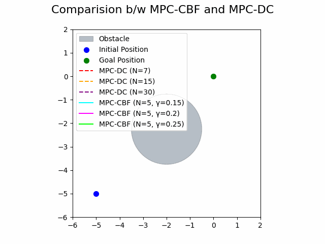
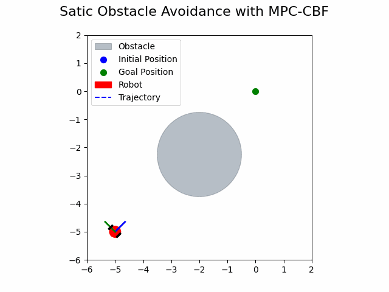
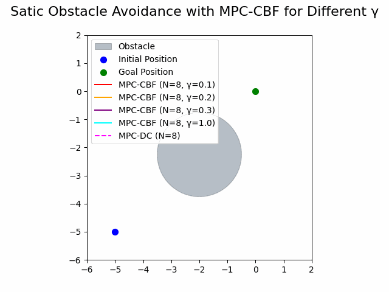
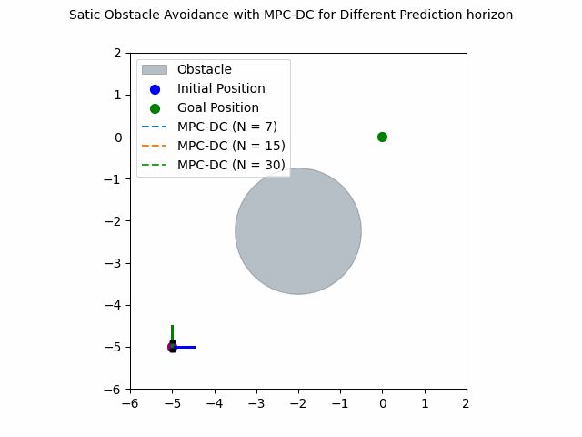

# Motion Planning of Mobile Robot using MPC-DC and MPC-CBF

This repository implements motion planning for a mobile robot using two advanced Model Predictive Control (MPC) strategies:
- **MPC-DC (Distance Constraints)** 
- **MPC-CBF (Control Barrier Functions)**

The project compares these methods through simulations, demonstrating their effectiveness in navigating a robot towards a goal while avoiding obstacles.

## Overview

Motion planning is a critical aspect of robotics, enabling safe navigation in environments with static and dynamic obstacles. This project implements and evaluates two approaches:

1. **MPC-DC:** A model predictive control technique with distance constraints for trajectory optimization.
2. **MPC-CBF:** An MPC approach integrated with control barrier functions to enforce safety constraints.

The robot dynamics are modeled using [The Unicycle Model](https://cooprobo.readthedocs.io/en/latest/mobile/pioneer/model/kinematics.html#the-unicycle-model), and the system is discretized with an RK4 solver. Python and CasADi are utilized for implementation. Both methods are evaluated based on their trajectories, computational cost, and ability to avoid obstacles under different conditions.

## Results

<table>
  <tr>
    <td align="center">
      <br>MOC-CBF vs MPC-DC
    </td>
    <td align="center">
      <br>MPC-CBF with static obstacle
    </td>
  </tr>

  <tr>
    <td align="center">
      <br>MOC-CBF with Hyperparameter tunig
    </td>
    <td align="center">
      <br>MPC-DC : Prediction Horizon Sensitivity
    </td>
  </tr>
  
</table>


## Installation

To get started with the project, follow these steps:

1. Clone the repository:
    ```bash
    git clone https://github.com/kushpatel19/Motion-Planning-MPC.git
    cd Motion-Planning-MPC
    ```

2. Install the required Python packages:
    ```bash
    pip install -r requirements.txt
    ```

## License

This project is licensed under the MIT License - see the [LICENSE](LICENSE) file for details.
